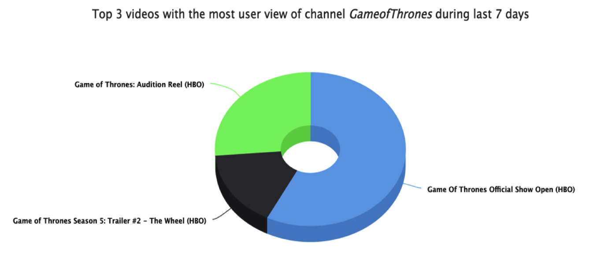

# GameofYouThrones

##About Insight Data Engineering program
This program is a 7 weeks intensive project based training program that helps engineers to prepare their career as data engineers. More details can be found here: www.insightdataengineering.com

##Story
Like many users, I often watch videos on YouTube, subscribe to some channels, and sometimes get subscription emails. It seems those channel owners can make money from not only ads, but also subscribers: http://bit.ly/1M8xzcD, http://bit.ly/1KWZYA4.

So I was curious if there was a way that could help channel owners to know the popularity of their videos and channels by user activity on YouTube: there are 8000~ channels, 400~ millions videos, and 1~ billion users, so you can imagine how many user activities are there each day, and this project was not only analytically interesting but also technically challenging.

##Dashboard
Here are two more concrete questions, i.e. queries that could be answered by my project:

1. By a given time span, which are the top X videos of channel Y that had the most time of views from users?

2. By a given time span, how many subscribers a given video X had driven for the channel it belonged to?

##Pipeline

The data of user activity from YouTube will be classified by Kafka, a distributed messenger, based on different types of user activties, say a user viewed a video on a channel, or a user subscribed to a channel from a video. The message will then be stored on HDFS, then transformed by Spark, and denormalized into HBase as a NoSQL schema. Finally, the Flask web framework will handle the front end query jobs.

One thing should be mentioned is that, although YouTube provides data of videos and channels by their API, user activity is private. So I had to generate such data by myself, and the size is roughly 100~200 GB level.

##Chanllenges
The biggest chanllenge in this project, is more than programming, i.e. how to use some technologies, but instead, knowing which technology should be used to resolve a certain problem and why should we use, is more important. This was my first time of using NoSQL and HBase, so I would like to talk more about this.

1. HBase rows

Since in NoSQL, there is no foreign key reference, what if we want to know the statictics of videos that belong to a given channel? 

-Solution: All rows are sorted automatically on HBase, and there is a function called "Scan" that could be used to return only a range of rows, say all rows begin with a prefix. Thus, by making the row key consisted of channelid_videoid, similar to the idea of "composite key", when we want to know all the videos assoicated with a channel, we could use the scan method to scan all rows begin that "channelid". The trade off is that there will be duplication of data, as now for each video, it will be duplicated twice.

2. HBase columns

Compared to RDBMS, NoSQL is schema free. When the data size is scaling up, NoSQL will be like a wide table, while RDBMS will be a tall table. Also, HBase is a columnar database, making queries on columns lower latency than RDBMS.

Motivated by this benefit, in my HBase, for each row, the predefined column families are the combination of user activity and statistics basis, say user view on daily or hourly basis, or user comment on daily but accumulative sum basis. The column member of each family will be the date or date time if hourly basis of that activity, and the value will be the number of activities happended on that date/time. The trade off is that the accumulative sum needs to be precalculated, making the data transformation more complicated. (See Spark batch)

3. Spark batch

To "denormalize" the table row key and "precalculate" the accumulative sum statistics, Spark batch transform the raw data of user activity by the word-count-like method, i.e. mapping data to key value pair, and then reducing, sorting and grouping by keys. The most complicated part was to reduce the complexity of the program. For instance, the hourly (or half-hourly) basis data will be calculated first, then the accumulative sum of each half-/hour, then the daily basis, and finally the daily accumulative sum of each day. By doing so, the amount of work could be optimized.
 

##Conclusion

